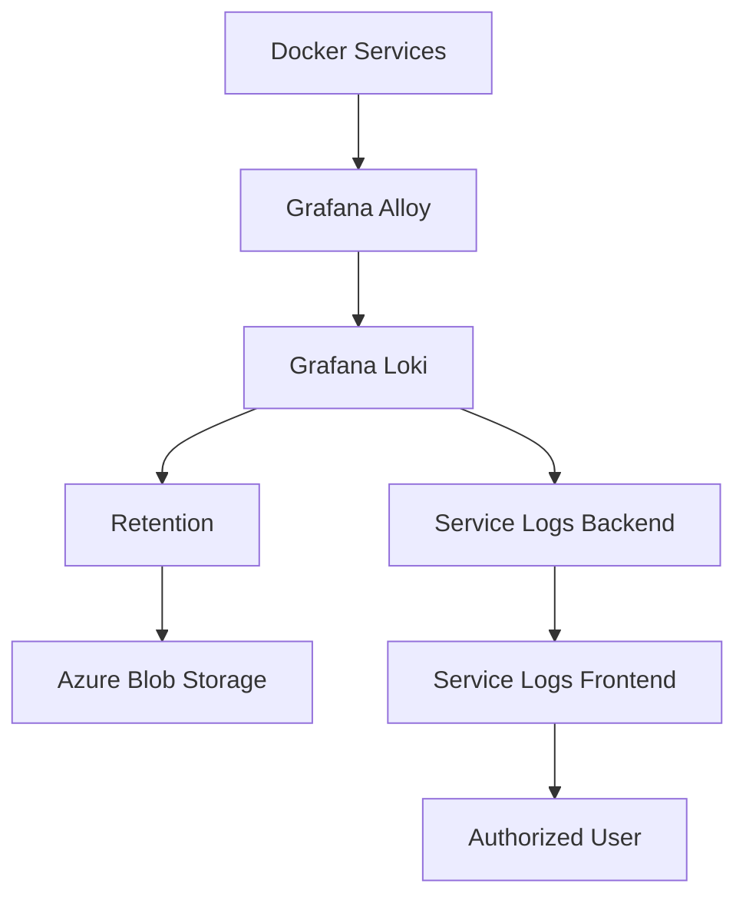

# Architecture

This document describes the conceptual architecture of the centralized Docker log retention system: the components involved, their responsibilities, and how data moves between them.

> **Note:** This is a conceptual architecture built for documentation purposes. It reflects the general design used in a real production environment, but all names, hosts, and endpoints have been replaced with placeholders.

---

## Components

### 1. Docker Services

The applications running as Docker containers. Each container writes logs to stdout/stderr, which Docker captures through its logging driver. These are the raw source of all log data in the system.

### 2. Grafana Alloy

Alloy runs as a log collection agent. It discovers running containers, reads their log output, and forwards it onward. Along the way, it attaches labels (metadata) that identify which service and container produced each log line.

### 3. Grafana Loki (3.7.3)

Loki receives the labeled log streams from Alloy and stores them in an indexed, queryable form. Loki indexes on labels (not full text), which is what makes it efficient to filter logs by service, container, or other metadata, and then search within that filtered set by time range.

### 4. Azure Blob Storage

Used as a long-term storage backend for logs that fall outside Loki's active/short-term retention window. This allows historical logs to be retained for longer periods without keeping all of that data in Loki's active storage indefinitely.

### 5. Service Logs Backend

A custom backend application that sits between the frontend UI and Loki. It translates user requests (service, date range, search terms) into Loki queries, and returns results in a format the frontend can display.

### 6. Service Logs Frontend

A UI that allows developers to select a service, pick a date range, search within logs, and download results — without needing direct access to Loki's query API or the underlying infrastructure.

### 7. Authorized Developer / User

The end consumer of the system. Uses the frontend to investigate issues, review historical behavior, or confirm that a fix took effect.

---

## Data Flow

1. A Docker service produces log output.
2. Grafana Alloy collects that output and attaches metadata (service name, container name, host, timestamp).
3. Alloy forwards the labeled log stream to Grafana Loki.
4. Loki indexes and stores the logs, retaining recent logs in active storage.
5. Once logs age past the active retention window, they can be moved to Azure Blob Storage for longer-term retention.
6. When a user needs to investigate something, the Service Logs Backend queries Loki (and, where applicable, the long-term store) on their behalf.
7. The Service Logs Frontend presents the results, letting the user filter, search, and download.

---

## Architecture Diagram

> This diagram represents the conceptual flow of the system. It intentionally omits infrastructure-specific detail such as network topology, hostnames, and resource names.

---

## Design Notes

- **Why Alloy + Loki instead of just `docker logs`:** `docker logs` only works as long as the container (or its log files) still exists. Centralizing collection through Alloy into Loki decouples log availability from container lifecycle.
- **Why labels matter:** Loki's performance and usability depend heavily on well-chosen labels. Labels should be low-cardinality and meaningful (e.g., `service_name`, `container_name`) rather than high-cardinality values that would bloat the index.
- **Why two storage tiers:** Keeping only recent logs in Loki's active storage keeps queries fast and storage costs manageable, while Azure Blob Storage provides a cheaper option for logs that are needed occasionally but not constantly.

See [`docs/implementation.md`](implementation.md) for how these components were configured and connected in phases.
